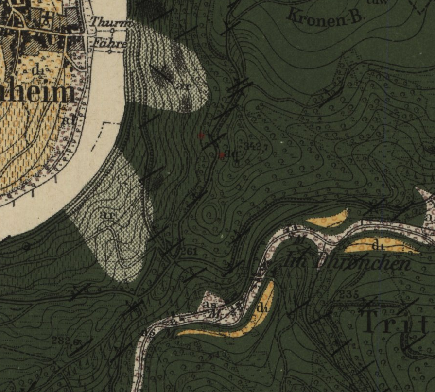
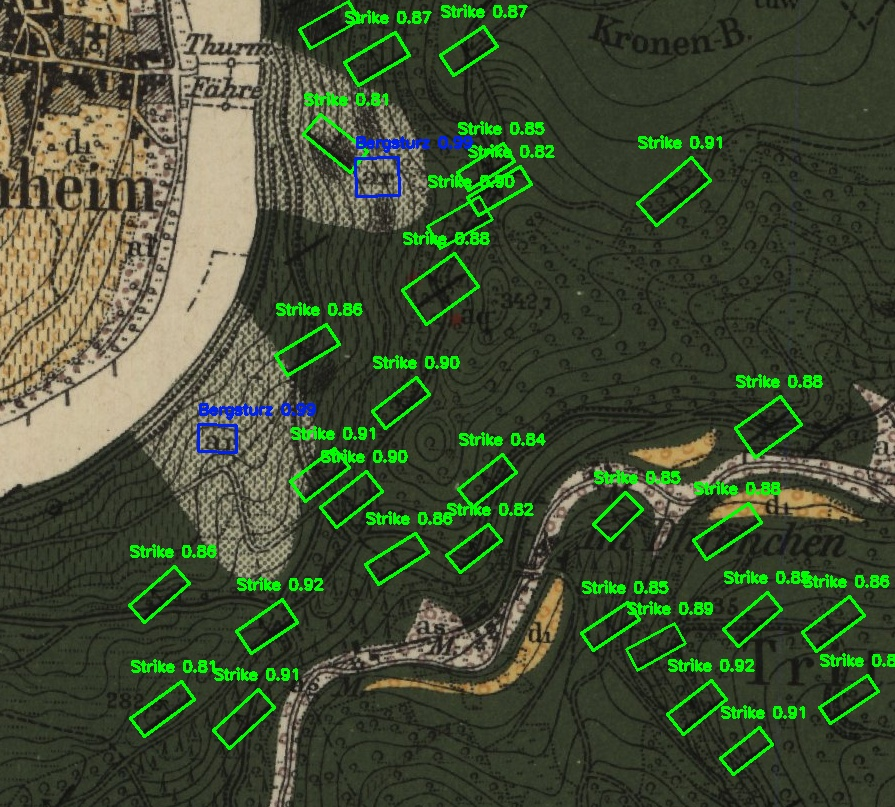

# 🛰️ Oriented Object Detection of Geological Symbols (YOLOv11-OBB)

This repository provides a complete pipeline for detecting geological symbols using **Oriented Bounding Boxes (OBB)** with **YOLOv11**.  
It supports both **3-channel RGB** and **4-channel (RGB + DT-Edge)** inputs, and allows **single-scale** and **dual-scale** inference fusion.

---

## 📁 Project Structure

```
├── Train_OBB.py           # Training pipeline (cropping, augmentation, training)
├── Detect_OBB.py          # Inference and post-processing with metrics
├── datasets/
│   └── GeoMap/
│       ├── images/
│       │   ├── train/
│       │   └── val/
│       ├── labels/
│       │   ├── train/
│       │   └── val/
│       ├── cropped128/    # Generated cropped tiles (128×128)
│       ├── cropped416/    # Generated cropped tiles (416×416)
│       ├── cropped4/      # 4-channel [RGB, DT-Edge] TIFFs
│       └── *.yaml         # YOLO data config files
├── Input/                 # Test images for detection
├── Output/                # Detection outputs (images + Excel files)
├── best128.pt             # Pretrained YOLOv11 model (128 px, RGB)
├── best416.pt             # Pretrained YOLOv11 model (416 px, RGB)
├── best416_4ch.pt         # Pretrained YOLOv11 model (416 px, 4-channel)
├── requirements.txt
└── README.md
```

---

## 🚀 Training Overview

### 🔧 Configuration

All parameters (tile size, overlap, number of channels, augmentation ratio, GPU options, etc.) are defined at the top of `Train_OBB.py`.  

**Key flags:**

| Flag | Description | Example |
|------|--------------|----------|
| `CHANNELS` | Input type: `3` = RGB, `4` = RGB + DT-Edge | `CHANNELS = 4` |
| `TILE_SIZE` | Tile size in pixels | `TILE_SIZE = 128` or `416` |
| `EPOCHS` | Number of training epochs | `EPOCHS = 150` |
| `BATCH_SIZE` | Batch size per GPU | `BATCH_SIZE = 16` |
| `overlap` | Overlap between tiles during cropping | `overlap = 100` |
| `Dual_GPU` | Enables multi-GPU training if available | `Dual_GPU = True` |
| `need_cropping` | Enable/disable tile generation | `need_cropping = True` |
| `need_augmentation` | Enable/disable class balancing via augmentation | `need_augmentation = True` |
| `R_TARGET` | Target ratio of empty-to-labeled tiles | `R_TARGET = 4` |

---

### 🧩 Training Pipeline

1. **Cropping**  
   Splits large maps into overlapping tiles (128×128 or 416×416), filters near-border objects, and saves non-empty tiles.

2. **Augmentation**  
   Oversamples underrepresented classes via scaling, shifting, HSV variation, and elastic transformations.

3. **4-Channel Conversion (Optional)**  
   Generates `[R, G, B, DT-Edge]` TIFFs by computing a distance-transform of multi-scale edge maps.

4. **Training Command**
   ```bash
   python Train_OBB.py
   ```
   - Uses Ultralytics YOLOv11-OBB or YOLOv8-OBB engines.  
   - Modify `CHANNELS` and `DATA_YAML` inside the script to select:
     - **3-channel single-scale**
     - **4-channel single-scale**

---

## 🔍 Detection & Evaluation

### 🔧 Configuration for Detection

All configurations are defined at the top of `Detect_OBB.py`.

#### For **dual-scale** detection:
```python
channels = 3        
tile_sizes = [128, 416]
overlaps = [30, 100]
models = [YOLO("best128.pt"), YOLO("best416.pt")]
```
#### For 3-channel **single-scale** detection:
To run only one model (e.g., 416 px, 3-channel):
```python
channels = 3
tile_sizes = [416]
overlaps = [100]
models = [YOLO("best416.pt")]
```

#### For 4-channel **single-scale** detection:
To run only one model (e.g., 416 px, 4-channel):
```python
channels = 4
tile_sizes = [416]
overlaps = [100]
models = [YOLO("best416_4ch.pt")]
```

Then execute:
```bash
python Detect_OBB.py
```

**Output:**
- Annotated image (`_detected.jpg`)
- Excel file with coordinates, class name, confidence, and strike angle

---

### 🧮 Evaluation Metrics

When `calculate_metrics = True`, the script computes:
- **Precision**, **Recall**, and **F1-score**
- **TP**, **FP**, and **FN**
- **mAP@0.5** and **mAP@[0.5:0.95]**
- **Soft mAP@0.3** and **Soft mAP@[0.3:0.7]** for partial matches
- **Center-Hit** accuracy

Example output:
```
[mAP Results]
Precision = 0.84 | Recall = 0.79 | F1 = 0.814
TP = 395 | FP = 75 | FN = 105
mAP@0.5 = 0.892
mAP@[0.5:0.95] = 0.736
mAP@0.3 = 0.915
mAP@[0.3:0.7] = 0.861
```

---

## 🧠 Channel Modes

| Mode | Description | File Output | Typical Use |
|------|--------------|-------------|--------------|
| **3-Channel RGB** | Standard RGB tiles | `.jpg` | Baseline training |
| **4-Channel (RGB + DT-Edge)** | Adds DT-Edge structural information | `.tiff` | Improves detection on low-contrast or textured maps |

---

## 🧩 Dual-Scale Fusion

During **late fusion**, detections from both scales are merged using class-wise IoU thresholds:
- Keeps stronger detection if both models detect the same object (IoU ≥ 0.4)
- Keeps single-scale detections if confidence ≥ 0.7
- Reduces fragmentation and false positives for small symbols

---

## 📦 Requirements

Install dependencies:
```bash
pip install -r requirements.txt
```

**requirements.txt**
```
numpy==1.26.4
opencv-python==4.11.0.86
ultralytics==8.3.196
shapely==2.0.7
openpyxl==3.1.5
pandas==2.3.3
```

---

## 💾 Pretrained Models

| Model | Channels | Tile Size | Download |
|--------|-----------|------------|-----------|
| `best128.pt` | 3 | 128 px | [Google Drive 🔗](https://drive.google.com/uc?export=download&id=1FfObPBAcyxpYThCBRFSJTTfgMLO7PjY2) |
| `best416.pt` | 3 | 416 px | [Google Drive 🔗](https://drive.google.com/uc?export=download&id=11SnTErkc4cmGvMRpJxfFy2da1c9S3s-0) |
| `best416_4ch.pt` | 4 | 416 px | [Google Drive 🔗](https://drive.google.com/uc?export=download&id=1WUa5hVUDzpBi6SS47Edw4TCWnuGxNahn) |

*(If using 4-channel mode, set `channels = 4` and `models = [YOLO("best416_4ch.pt")]`.)*

---

## 🖼️ Example

### Input  


### Output  


---

## 📜 License

This project is released under the **MIT License**.  
You may freely use and adapt the code for research and educational purposes.

See the [LICENSE](./LICENSE) file for full details.
